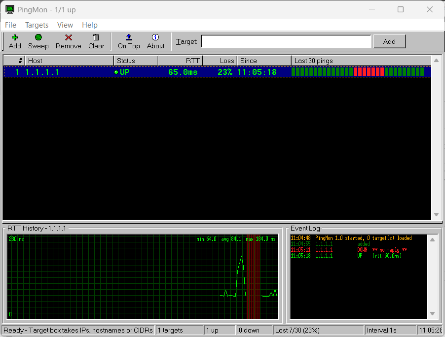

# pingmon

A ping monitor in two versions that share one engine and one target list:

| Version | File | Start |
|---|---|---|
| **Console (CLI)**: Linux, macOS, WSL, Windows | `pingmon.py` | `python3 pingmon.py` |
| **Windows (GUI)**: Win9x-style window | `pingmon_gui.pyw` | [PingMon.exe](https://github.com/Salzstangee/network-tools/releases/latest/download/PingMon.exe), no Python needed |

The CLI is Python 3 standard library only; the exe has everything bundled.

## Console version (CLI)

You add hosts at a prompt, a background thread pings them continuously, and a
table shows who is up, who is down, the round-trip time, *since when* each host
has been in its current state, and how many pings it has dropped. Targets are
remembered between runs.

```
  #  HOST            STATUS         RTT   LOSS  SINCE     LAST 30 PINGS
-----------------------------------------------------------------------
  1  10.20.30.1      ● UP         0.4ms     0%  09:12:03  ██████████████████████████████
  2  10.20.30.14     ● UP         1.1ms     7%  09:12:03  ████████████████████░░████░░██
  3  SW01            ● DOWN           -    41%  09:41:57  ██████░░░░░░░░░░░░░░░░░░░░░░░░
  4  8.8.8.8         ● UP        21.0ms    <1%  09:12:03  ██████████████████████████████

4 targets — 3 up, 1 down, 0 unknown   37/1204 pings lost (3%)   (interval 1s, 09:44:12)
```

The `LAST 30 PINGS` strip is the loss graph: one block per ping, green for a
reply and red for a drop (`░` above), newest at the right edge. A short drop that has since
recovered stays visible for 30 rounds, which the STATUS column alone cannot
show you.

## Windows version (GUI)



Download: [PingMon.exe](https://github.com/Salzstangee/network-tools/releases/latest/download/PingMon.exe)
(single file, no install, no Python needed)

`pingmon_gui.pyw` is a Win9x-style window around the same engine as the CLI: target list,
Task-Manager-style RTT graph for the selected host, event log of up/down
changes, network sweep with progress bar, beep on outage, always-on-top. It
shares `~/.pingmon_targets` with the console version, which stays as it is.

**Settings** menu (GUI only): *Start with Windows* (per-user `HKCU\...\Run` entry,
no admin), *Start Minimized to Tray*, *Close to Tray* (keeps monitoring in the
background) and *Tray Notification on Host Down*. The tray icon turns red while
a host is down; click it to open the window, right-click for Exit. Settings are
kept in `~/.pingmon_settings.json`. Starting PingMon a second time just brings
the running one to the front.

Put `PingMon.exe` in a fixed folder (e.g. `%LOCALAPPDATA%\PingMon`) before
enabling autostart, since the Run entry points at that exact path. On Windows 11
new tray icons sit behind the `^` arrow until you drag them out once.

- Run from source: `pythonw pingmon_gui.pyw` (Windows) or `python3 pingmon_gui.pyw`;
  the tray needs `pip install pystray pillow`, everything else is standard library
- `PingMon.exe`: built by GitHub Actions on every push to `main` (download it
  from the run's artifacts), attached to the release when a `v*` tag is pushed.
- Build locally on Windows:
  `pip install pyinstaller pystray pillow`, then
  `pyinstaller --onefile --windowed --name PingMon --icon pingmon.ico --hidden-import pystray._win32 pingmon_gui.pyw`

---

The sections below describe the **console version**. Persistence,
configuration and "How it works" apply to both versions.

## Requirements

- Python 3.6+ (no third-party packages)
- A working `ping` binary in `PATH` — the system one is called as a subprocess

Runs on Linux, macOS, WSL, and Windows; the ping flags and output parsing are
switched per platform (including German-locale `Zeit=` output).

## Usage

```bash
python3 pingmon.py                          # start with saved targets
python3 pingmon.py 10.20.30.1 8.8.8.8       # start and add these
python3 pingmon.py 10.20.30.0/24            # start and sweep this network
```

Or make it executable and run it directly:

```bash
chmod +x pingmon.py
./pingmon.py
```

## Commands

Typed at the `>` prompt:

| Command | Aliases | What it does |
|---|---|---|
| `add <ip\|host\|cidr> [...]` | `a` | Add targets. CIDRs are swept — see below |
| `del <ip\|host\|#> [...]` | `d`, `rm`, `remove` | Remove targets by name or by table number |
| `clear` | `c` | Remove every target **except the first one** |
| `clear all` | `c all` | Remove every target |
| `list` | `l`, `ls` | Print the status table once |
| `watch` | `w` | Live table, refreshing every second |
| `interval <sec>` | | Change the ping interval (minimum 1s) |
| `help` | `h`, `?` | Show the command list |
| `quit` | `q`, `exit` | Save and exit |

Pressing Enter on an empty prompt prints the table — same as `list`.

In `watch` mode the screen refreshes every second until you press Enter, which
drops you back to the prompt. `Ctrl-C` or `Ctrl-D` at the prompt exits cleanly
and saves.

### Adding hosts

Arguments are space-separated, and you can mix forms freely:

```
> add 10.20.30.1 SW01 8.8.8.8
  added 10.20.30.1
  added SW01
  added 8.8.8.8
```

Hostnames work anywhere an IP does. Commas are **not** separators — `add a,b`
is treated as one host named `a,b`. Adding a host that is already listed leaves
the existing entry (and its state history) untouched.

### Sweeping a network

Any argument containing `/` is parsed as a network, pinged in parallel, and
**only the addresses that answer are added**:

```
> add 10.20.30.0/24
  sweeping 10.20.30.0/24 (254 addresses)
  scanning 254/254 — 7 up
  7 reachable, 7 added
```

Details worth knowing:

- The network address and broadcast address are skipped; a `/32` yields its
  single address.
- You do not need to give the network address — `10.20.30.7/24` is accepted and
  normalised to the containing `/24`.
- Discovered hosts are added in numeric IP order, not in the order they replied.
- Anything larger than **1024 addresses** (`/22`) is refused, so a mistyped
  `/16` cannot start a 65k-address sweep:
  `10.0.0.0/16 covers 65534 addresses — limit is 1024`
- The sweep blocks the prompt while it runs. A full `/22` takes roughly 15–20
  seconds; a `/24` is a few seconds.
- **A host that is down during the sweep is never added.** Once a host *is* on
  the list, later outages show up as DOWN as normal — the sweep is discovery,
  not monitoring.
- Discovery is **ICMP-only**, so hosts that filter ping (Windows clients with
  the firewall enabled, for example) will not be found. Network gear is
  generally fine.

### Removing hosts

By name, or by the number in the table:

```
> del 3 SW01
```

Numbers refer to the table as printed at that moment. Deleting several by
number in one command shifts the remaining numbers as it goes, so for multiple
deletions either delete highest-number-first or just use the names.

To empty the list instead, `clear` keeps target **#1** and drops the rest —
handy when #1 is your reference host (a gateway or `8.8.8.8`) and everything
else was a one-off sweep:

```
> clear
  removed 6 targets, kept 10.20.30.1
```

`clear all` leaves nothing behind. Neither asks for confirmation and neither
can be undone — the new list is saved immediately — but since the file is just
a host list, re-adding is cheap.

## Persistence

Targets are stored one per line in `~/.pingmon_targets`, written on every add,
delete, and exit, and read back at startup. Lines starting with `#` are ignored
on read, which makes bulk-loading easy:

```bash
printf '10.20.30.1\n10.20.30.2\nSW01\n' >> ~/.pingmon_targets
```

Note that the file is **rewritten** whenever the target list changes, so any
comments or blank lines you put there are dropped the first time you add or
remove a host from inside the app.

Only the host list is persisted — up/down state, the SINCE timestamps, and the
loss counters/graph all start fresh each run.

## Configuration

Constants at the top of `pingmon.py`:

| Constant | Default | Meaning |
|---|---|---|
| `INTERVAL` | `1.0` | Seconds between ping rounds (also settable at runtime) |
| `TIMEOUT` | `1` | Seconds to wait for a single reply |
| `SCAN_WORKERS` | `64` | Parallel pings during a network sweep |
| `MAX_SCAN_HOSTS` | `1024` | Largest network the sweep will accept |
| `HISTORY` | `30` | Pings kept per host for the loss graph (= strip width) |
| `STATE_FILE` | `~/.pingmon_targets` | Where the target list is saved |

If you want to sweep bigger ranges, raising `SCAN_WORKERS` is the better knob —
sweep time scales with `hosts / workers`.

## How it works

- One background worker thread wakes every `INTERVAL` seconds and pings all
  current targets **in parallel** (one thread per target), so the round takes
  about as long as the slowest single ping rather than the sum of them.
- Each result updates a shared dict under a lock. The `SINCE` timestamp is only
  touched when the up/down state actually *changes*, which is what makes it a
  flap/outage marker rather than a "last checked" clock.
- Network sweeps use a bounded `ThreadPoolExecutor` instead of one thread per
  address, so a `/22` does not spawn a thousand threads.
- Status is colour-coded with ANSI escapes: green ● UP, red ● DOWN, grey ● …
  for a target that has not been checked yet.
- Each target keeps a `deque(maxlen=HISTORY)` of results for the graph plus two
  running totals for the LOSS column. The percentage is therefore over the whole
  run, while the strip only covers the last `HISTORY` rounds — a host at `41%`
  with an all-green strip has recovered from an earlier outage.
- A non-zero loss never rounds down to `0%`; anything below one percent prints
  as `<1%`.

## Limitations

- ICMP only — no TCP-port or ARP-based discovery, so firewalled hosts look down.
- IPv4-oriented in practice; IPv6 addresses work as plain targets, but sweeping
  an IPv6 prefix is not useful and will hit the size limit immediately.
- No logging or alerting — state lives in memory and is lost on exit, loss
  counters included.
- The loss graph adds 30 columns to the table; with long hostnames it wants a
  terminal around 110 columns wide before it wraps. Lower `HISTORY` if that is
  tight.
- On most systems the unprivileged `ping` binary is used, so no raw-socket
  permissions are needed, but very locked-down images may not ship one.